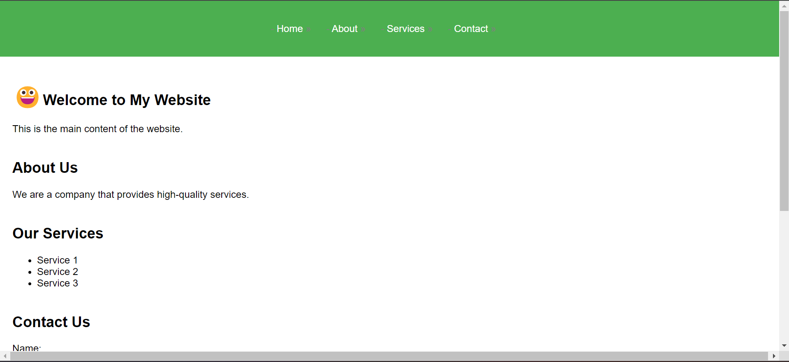
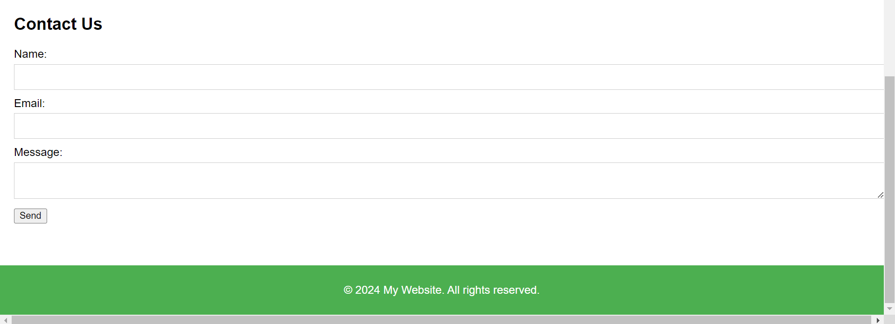

# PSEUDO-ELEMENT 
Pseudo elemen adalah bagian virtual dari elemen HTML yang dapat dipilih dan diubah gaya tampilannya menggunakan CSS. Mereka digunakan untuk memodifikasi atau menambahkan gaya ke bagian-bagian tertentu dari elemen, tanpa harus menambahkan elemen HTML tambahan.

Pseudo elemen ditandai dengan menggunakan tanda titik dua (::) setelah nama elemen dalam aturan CSS. Dua tanda titik dua (::) digunakan untuk pseudo elemen yang diperkenalkan dalam standar CSS3, sedangkan sebuah tanda titik dua (:) digunakan untuk pseudo elemen yang diperkenalkan dalam standar CSS2.

Perbedaan antara standar CSS2 dan CSS3:
1.Waktu Rilis:
- CSS2: CSS2 diterbitkan pada tahun 1998.
- CSS3: CSS3 adalah pengembangan berkelanjutan dari CSS2 dan diperkenalkan secara bertahap sejak tahun 1999. Sebagai standar yang lebih baru, CSS3 terus mengalami penambahan dan pembaruan dari waktu ke waktu.
2.Modul:
- CSS2: CSS2 terdiri dari satu modul utama dan beberapa modul tambahan yang mendefinisikan berbagai fitur dan properti CSS.
 - CSS3: CSS3 dibagi menjadi banyak modul yang berbeda, masing-masing fokus pada aspek tertentu dari desain web. Setiap modul CSS3 berkembang secara independen, yang memungkinkan penambahan fitur baru tanpa harus menunggu rilis keseluruhan.
3.Fitur dan Kemampuan:
- CSS2: CSS2 menyediakan seperangkat fitur dasar yang mencakup pemformatan teks, warna, tata letak, pengelolaan lapisan, dan selektor.
- CSS3: CSS3 memperkenalkan banyak fitur baru yang meliputi efek transisi, animasi, transformasi 2D/3D, bayangan, gradien, tata letak responsif, media queries, dan banyak lagi. CSS3 juga memperkenalkan pseudo elemen yang lebih banyak dan peningkatan dalam selektor CSS.
4.Kompatibilitas Browser:
- CSS2: Mayoritas browser yang digunakan pada saat CSS2 diterbitkan telah mendukung sebagian besar fitur CSS2.
- CSS3: Implementasi fitur CSS3 oleh browser-browser modern beragam. Beberapa fitur CSS3 mungkin tidak didukung secara penuh di semua browser, dan beberapa fitur mungkin memerlukan pr


# Beberapa Contoh Pseudo-Element
## 1. ::Before & ::After 
adalah bagian dari CSS Pseudo-Elements yang memungkinkan Anda untuk menyisipkan konten tambahan sebelum atau setelah konten aktual suatu elemen HTML. Dengan menggunakan pseudo-element ini, Anda dapat menambahkan elemen dekoratif atau konten tambahan ke dalam elemen HTML tanpa harus mengubah struktur HTML itu sendiri.

```css
.custom-button::before {
  content: "🔴 ";
  color: red;
  margin-right: 5px;
}

.custom-button::after {
  content: " 🔴";
  color: red;
  margin-left: 5px;
}
```

## 2. ::First-Letter & ::First-line
### Letter 
::first-letter: Pseudo-elemen ::first-letter digunakan untuk memilih dan memanipulasi huruf pertama dalam teks yang ada di dalam elemen tertentu. Ini memungkinkan Anda menerapkan gaya khusus, seperti ukuran huruf yang lebih besar, jenis huruf yang berbeda, atau warna teks yang berbeda, pada huruf pertama dari kata atau paragraf.

Contoh penggunaan CSS untuk pseudo-elemen ::first-letter:
```css
   p::first-letter {
     font-size: 20px;
     font-weight: bold;
     color: red;
   }
```
Dalam contoh di atas, huruf pertama dari setiap paragraf akan memiliki ukuran huruf 20 piksel, tebal huruf yang lebih tebal, dan warna teks merah.
   
### Line
::first-line: Pseudo-elemen ::first-line digunakan untuk memilih dan memanipulasi baris pertama dalam teks yang ada di dalam elemen tertentu. Ini memungkinkan Anda menerapkan gaya khusus pada baris pertama, seperti mengubah ukuran huruf, gaya teks, atau margin.

Contoh penggunaan CSS untuk pseudo-elemen ::first-line:
```css
   p::first-line {
     font-size: 18px;
     font-style: italic;
     color: blue;
     margin-left: 20px;  
     }
    
```
Dalam contoh di atas, baris pertama dari setiap paragraf akan memiliki ukuran huruf 18 piksel, gaya huruf miring, warna teks biru, dan margin kiri sebesar 20 piksel.
### Kesimpulan
Penting untuk dicatat bahwa pseudo-elemen ::first-letter dan ::first-line hanya dapat digunakan dengan elemen teks seperti `<p>`, `<h1>`, `<span>`, dan sebagainya. Selain itu, dukungan untuk pseudo-elemen ini mungkin bervariasi tergantung pada browser yang digunakan.

## 3. ::Selection 
Pseudo elemen dalam CSS digunakan untuk memanipulasi atau memodifikasi bagian-bagian spesifik dari elemen HTML tertentu. Salah satu pseudo elemen yang sering digunakan adalah ::before dan ::after, yang digunakan untuk menambahkan konten tambahan sebelum atau setelah isi elemen tersebut.

Jika ingin memilih atau memanipulasi teks yang dipilih oleh pengguna, maka kita dapat menggunakan pseudo kelas ::selection. Pseudo kelas ini memungkinkan Anda untuk mengatur gaya teks dan latar belakang teks yang dipilih oleh pengguna di dalam elemen.

Berikut adalah contoh penggunaan pseudo kelas ::selection dalam CSS:

```css
::selection {
  color: white;
  background-color: blue;
}
```

Dalam contoh di atas, ketika pengguna memilih teks di dalam elemen yang menggunakan pseudo kelas ::selection, teks yang dipilih akan memiliki warna teks putih dan latar belakang biru.

Harap diingat bahwa dukungan untuk pseudo kelas ::selection dapat bervariasi di beberapa browser. Jadi, pastikan untuk menguji tampilan pada berbagai browser untuk memastikan konsistensi penampilan.
# Kode Program
ANALISIS
1. **Struktur Dasar HTML**:
    
    - Dokumen ini dimulai dengan deklarasi `<!DOCTYPE html>` yang menandakan bahwa ini adalah dokumen HTML5.
    - Elemen `<html>` merupakan elemen root yang berisi seluruh konten halaman web.
    - Elemen `<head>` berisi metadata seperti judul halaman, viewport, dan link ke file CSS eksternal.
    - Elemen `<body>` berisi struktur dan konten utama dari halaman web.
2. **Struktur Konten dan Navigasi**:
    
    - Elemen `<header>` berisi navigasi untuk halaman web, dengan daftar tautan (`<ul>` dan `<li>`) yang mengarah ke bagian-bagian utama seperti "Home", "About", "Services", dan "Contact".
    - Elemen `<main>` berisi konten utama yang terdiri dari beberapa `<section>` yang masing-masing memiliki judul dan teks.
    - Elemen `<footer>` berisi informasi hak cipta.
3. **Fitur Formulir Kontak**:
    
    - Bagian "Contact Us" berisi sebuah formulir dengan label, input teks, input email, textarea, dan tombol "Send".
    - Atribut `required` pada input dan textarea memastikan bahwa pengguna harus mengisi semua field sebelum mengirim formulir.
4. **Link CSS Eksternal**:
    
    - Halaman web ini menggunakan file CSS eksternal bernama "pseu.css" untuk menerapkan gaya dan format pada kontennya.
```HTML
<!DOCTYPE html>
<html lang="en">
<head>
  <meta charset="UTF-8">
  <meta name="viewport" content="width=device-width, initial-scale=1.0">
  <title>My Website</title>

  <link rel="stylesheet" href="pseu.css">

</head>

<body>

  <header>

    <nav>

      <ul>

        <li><a href="#">Home</a></li>

        <li><a href="#">About</a></li>

        <li><a href="#">Services</a></li>

        <li><a href="#">Contact</a></li>

      </ul>

    </nav>

  </header>

  

  <main>

    <section>

      <h1>Welcome to My Website</h1>

      <p>This is the main content of the website.</p>

    </section>

  

    <section>

      <h2>About Us</h2>

      <p>We are a company that provides high-quality services.</p>

    </section>

  

    <section>

      <h2>Our Services</h2>

      <ul>

        <li>Service 1</li>

        <li>Service 2</li>

        <li>Service 3</li>

      </ul>

    </section>

  

    <section>

      <h2>Contact Us</h2>

      <form>

        <label for="name">Name:</label>

        <input type="text" id="name" name="name" required>

  

        <label for="email">Email:</label>

        <input type="email" id="email" name="email" required>

  

        <label for="message">Message:</label>

        <textarea id="message" name="message" required></textarea>

  

        <button type="submit">Send</button>

      </form>

    </section>

  </main>

  

  <footer>

    <p>&copy; 2024 My Website. All rights reserved.</p>

  </footer>

</body>

</html>
```

ANALISIS
1. **Pseudo-element ::before**:
    - Pada selector `nav ul li::before`, CSS menggunakan pseudo-element `::before` untuk menambahkan konten berupa simbol "-" sebelum setiap elemen `<li>` di dalam `<nav>`.
    - Tujuannya adalah untuk memberikan visual cue atau tanda pada setiap item navigasi.
2. **Pseudo-element ::after**:
    - Pada selector `nav ul li a::after`, CSS menggunakan pseudo-element `::after` untuk menambahkan konten berupa simbol "»" setelah setiap tautan `<a>` di dalam `<li>`.
    - Ini juga bertujuan untuk memberikan visual cue atau tanda pada setiap item navigasi.
3. **Pseudo-element ::first-letter**:
    - Pada selector `h1::first-letter`, CSS menggunakan pseudo-element `::first-letter` untuk membuat huruf pertama dari setiap judul `<h1>` menjadi lebih besar dan tebal.
    - Ini merupakan salah satu cara untuk memperjelas atau menonjolkan huruf pertama dari judul.
4. **Pseudo-element ::selection**:
    - Pada selector `::selection`, CSS menggunakan pseudo-element `::selection` untuk mengubah warna latar belakang dan teks saat pengguna menyeleksi teks pada halaman.
    - Ini dapat berguna untuk memberikan visual feedback atau penekanan pada teks yang diseleksi.
5. **Gaya Umum**:
    - Selebihnya, kode CSS mengatur gaya umum untuk elemen-elemen pada halaman, seperti font, margin, padding, warna, dan lain-lain.
    - Ini memastikan halaman web memiliki tampilan yang konsisten dan estetis.
```CSS
/* Pseudo-element ::before */

nav ul li::before {

  content: "- ";

  color: grey;

}

  

/* Pseudo-element ::after */

nav ul li a::after {

  content: " »";

  color: grey;

}

  

/* Pseudo-element ::first-letter */

h1::first-letter {

  font-size: 150%;

  font-weight: bold;

}

  

/* Pseudo-element ::selection */

::selection {

  background-color: #4CAF50;

  color: white;

}

  

/* Other CSS styles */

body {

  font-family: Arial, sans-serif;

  margin: 0;

  padding: 0;

}

  

header {

  background-color: #4CAF50;

  padding: 20px;

  text-align: center;

}

  

nav ul {

  list-style-type: none;

  padding: 0;

}

  

nav ul li {

  display: inline;

  margin-right: 20px;

}

  

nav ul li a {

  color: white;

  text-decoration: none;

}

  

main {

  padding: 20px;

}

  

section {

  margin-bottom: 40px;

}

  

form label {

  display: block;

  margin-bottom: 5px;

}

  

form input, form textarea {

  width: 100%;

  padding: 10px;

  margin-bottom: 10px;

  border: 1px solid #ccc;

}

  

footer {

  background-color: #4CAF50;

  color: white;

  padding: 10px;

  text-align: center;

}

  

h1::before {

  content: "😀";

}
```
# Hasil


